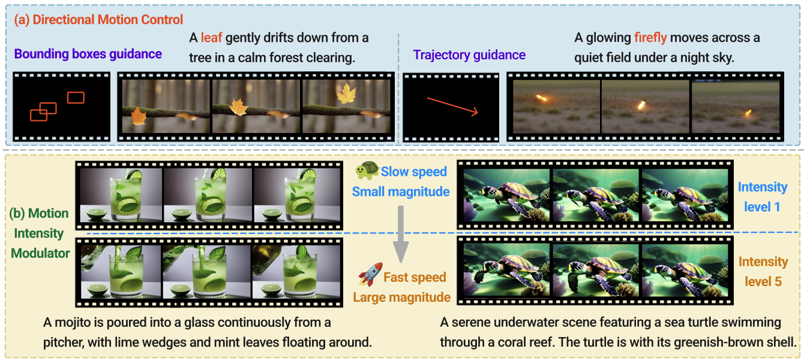

# Mojito


[Xuehai He](https://sheehan1230.github.io/), [Shuohang Wang](https://scholar.google.com.sg/citations?user=mN-IO6wAAAAJ&hl=zh-CN), [Jianwei Yang](https://jwyang.github.io/), [Xiaoxia Wu](https://xwushirley.github.io/), [Yiping Wang](https://ypwang61.github.io/), [Kuan Wang](https://scholar.google.com/citations?hl=en&user=c1-_-dUAAAAJ&view_op=list_works&sortby=pubdate), [Zheng Zhan](https://zhanzheng8585.github.io/), [Olatunji Ruwase](https://www.microsoft.com/en-us/research/people/olruwase/), [Yelong Shen](https://scholar.google.com/citations?user=S6OFEFEAAAAJ&hl=en), [Xin Eric Wang](https://eric-xw.github.io/)

<a href='https://arxiv.org/abs/2412.08948'></a> <a href='https://sites.google.com/view/mojito-video'></a> [](https://github.com/eric-ai-lab/Mojito)
</a>




The code will be released soon. 

## TODO
- [] Gradio Demo
- [] Huggingface setup
- [] Release training-free DMC module
- [] Release training code
- [] Release inference code


## News
* `2025.2.10`  🚀 Release the [project website](https://sites.google.com/view/mojito-video)!


## Citation

```
@article{he2024mojito,
  title   = {Mojito: Motion Trajectory and Intensity Control for Video Generation},
  author  = {Xuehai He and Shuohang Wang and Jianwei Yang and Xiaoxia Wu and Yiping Wang and Kuan Wang and Zheng Zhan and Olatunji Ruwase and Yelong Shen and Xin Eric Wang},
  year    = {2024},
  journal = {arXiv preprint arXiv: 2412.08948}
}
```
